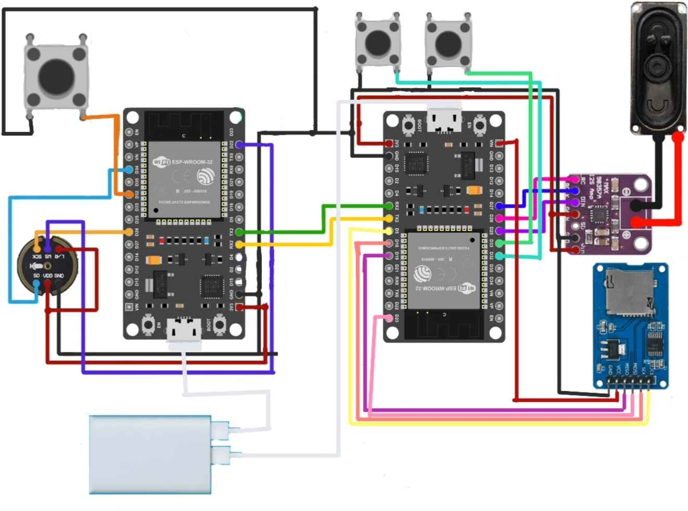

<h1>Final Project - Systems Programming</h1>
Personal Assistant, called "May", using the microcontroller esp32. This project integrates certain peripherals, such as a speaker, amplifier, mic, and buttons. This system requier 2 esp32.
One esp23 is responsible for the speech-to-text and generation of responses through API calls. The other esp32 is used for Text-to-speech, which is done through API calls. 
We used Google TTS, Google STT, and OpenAPI to make this system work. We also created our 2 APIs to generate a response that is not verbose(Technology Used: NGINX. Flask, Gunicorn). 
One of the API is responsible of returning a new thread, and the other API is responsible for returning a response based on passed question and thread arguments.

<h3>Connection/Schema of this system:</h3>

<h2><b>Demo Link: https://youtube.com/shorts/BKbqWCkmIhg?si=BnzSsZCHz6D4yi-C</b></h2>

